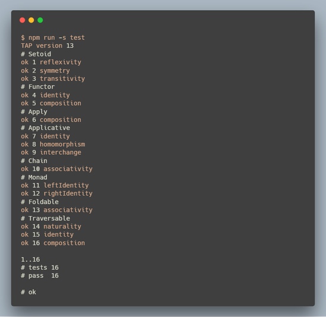

Haskell inspired, [Fantasy Land](https://github.com/fantasyland/fantasy-land) -compliant rose tree with JavaScript and [Sanctuary](https://github.com/sanctuary-js/sanctuary).

This is part of an examination of the mentioned resources, and does not quite represent my preferred engineering structure.

## Features

 - Implements the Fantasy Land specifications: Setoid, Functor, Apply, Applicative, Chain, Monad, Foldable, Traversable
 - Verifies pertinent algebraic laws by property-based testing with [JSVerify](https://github.com/jsverify/jsverify) and [fantasy-laws](https://github.com/fantasyland/fantasy-laws)
 - Highly instructional

## Examples

Basic usage:  
```javascript
> tree = Node (1) ([Node (4) ([Node (9) ([])])])
RoseTree 1 [RoseTree 4 [RoseTree 9 []]]

> t1 = S.map (Math.sqrt) (tree)
RoseTree 1 [RoseTree 2 [RoseTree 3 []]]

> S.equals (t1) (Node (1) ([Node (2) ([Node (3) ([])])]))
true

> S.of (Tree) (10)
RoseTree 10 []

> S.reduce (S.add) (0) (tree)
14

> flatten (tree)
[1, 4, 9]

> tree2 = Node ("a") ([Node ("b") ([Node ("c") ([])])])
RoseTree "a" [RoseTree "b" [RoseTree "c" []]]

> S.traverse (S.Maybe) (S.parseInt (16)) (tree2)
Just (RoseTree 10 [RoseTree 11 [RoseTree 12 []]])

> S.traverse (S.Maybe) (S.parseInt (16)) (Node ("x") ([]))
Nothing

> buildNode = x => (2*x+1) > 7 ? [x, []] : [x, [2*x, 2*x+1]]

> unfoldTree (buildNode) (1)
RoseTree 1 [RoseTree 2 [RoseTree 4 [], RoseTree 5 []], RoseTree 3 [RoseTree 6 [], RoseTree 7 []]]

> f1 = x => Node (2*x) ([Node (3*x) ([])])

> S.chain (f1) (t1)
RoseTree 2 [RoseTree 3 [], RoseTree 4 [RoseTree 6 [], RoseTree 6 [RoseTree 9 []]]]

> tf1 = Node (S.mult (4)) ([Node (S.negate) ([]), Node (S.sub (7)) ([])])

> S.ap (tf1) (tree)
RoseTree 4 [RoseTree 16 [RoseTree 36 []], RoseTree -1 [RoseTree -4 [RoseTree -9 []]], RoseTree -6 [RoseTree -3 [RoseTree 2 []]]]
```

Running tests:  


## License

This project is licensed under the MIT License - see the [LICENSE](./LICENSE.md) file for details
