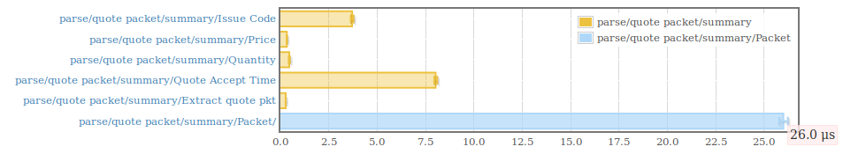
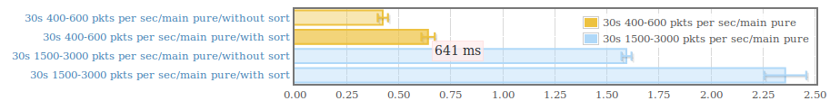
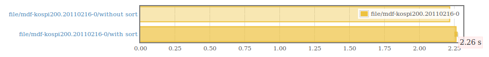
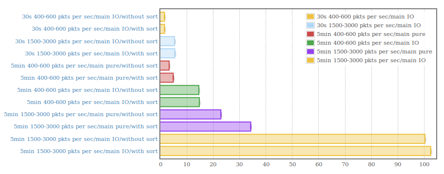

A code sample to show my profiency in Haskell, for an internship position at [Tsuru Capital](https://www.tsurucapital.com/en/), according to what's stated [here](https://www.tsurucapital.com/en/code-sample.html).

## Remarks

The program is able to process a large volume of data with decent performance.

Possible optimizations that come to mind:
 - Tackling cost centers
 - A different backend (e.g LLVM) 
 - Non-naive concurrency (naive stm-conduit didn't cut it)

## Performance measureaments

Hardware:
```
CPU: Intel i5-3230M (4) @ 3.200GHz
Memory: 5851MiB
HD: 120gb SATA 5400rpm
```

Parsing:
[](https://leosbotelho.github.io/tsuru-capital-code-sample/parsing.html)

Pure main with arbitrary data:
[](https://leosbotelho.github.io/tsuru-capital-code-sample/main-pure-30s.html)

Main with original data:
[](https://leosbotelho.github.io/tsuru-capital-code-sample/main-original.html)

Main with more arbitrary data:
[](https://leosbotelho.github.io/tsuru-capital-code-sample/main-more.html)

## Tests

Successful tests run:
[](https://asciinema.org/a/z6iVMd6pGqPWAopIe5F0RmH8F)
